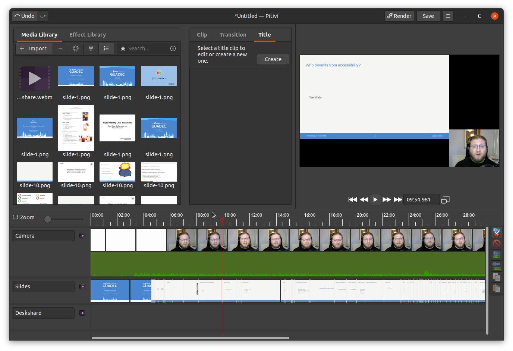

When the pandemic lock downs started, my [local Linux User
Group](https://www.plug.org.au) started looking at video conferencing
tools we could use to continue presenting talks and other events to
members. We ended up adopting
[BigBlueButton](https://docs.bigbluebutton.org/): as well as being Open
Source, it\'s focus on education made it well suited for presenting
talks. It has the concept of a presenter role, and built in support for
slides (it sends them to viewers as images, rather than another video
stream). It can also record sessions for later viewing.

To view those recordings though, you need to use BBB\'s web player. I
wanted to make sure we could keep the recordings available should the
BBB instance we were using went away. Ideally, we\'d just be able to
convert the recordings to self contained videos files that could be
archived and published along side our other recordings. There are a few
tools intended to help with this:

-   [bbb-recorder](https://github.com/jibon57/bbb-recorder): screen
    captures Chrome displaying BBB\'s web player to produce a video.
-   [bbb-download](https://github.com/createwebinar/bbb-download): this
    one is intended to run on the BBB server, and combines slides,
    screen share and presentation audio using ffmpeg. Does not include
    webcam footage.

I really wanted something that would include both the camera footage and
slides in one video, so decided to make my own. The result is
bbb-render:

<https://github.com/plugorgau/bbb-render>

At the present, it consists of two scripts. The first is `download.py`,
which takes the URL of a public BBB recording and downloads all of its
assets to a local folder. The second is `make-xges.py`, which assembles
those assets so they\'re ready to render.

The resources retrieved by the download script include:

`video/webcams.webm`:
:   Video from the presenters\' cameras, plus the audio track for the
    presentation.

`deskshare/deskshare.webm`:
:   Video for screen sharing segments of the presentation. This is the
    same length as the webcams video, with blank footage when nothing is
    being shared.

`deskshare.xml`:
:   Timing information for when to show the screen share video, along
    with the aspect ration for a particular share session

`shapes.svg`:
:   An SVG file with custom timing attributes that is uses to present
    the slides and whiteboard scribbles. By following links in the SVG,
    we can download all the slide images.

`cursor.xml`:
:   Mouse cursor position over time. This is used for the \"red dot
    laser pointer\" effect.

`slides_new.xml`:
:   Not actually slides. For some reason, this is the text chat replay.

My first thought to combine the various parts was to construct a
[GStreamer](https://gstreamer.freedesktop.org/) pipeline that would play
everything back together, using timers to bring slides in and out. This
turned out to be easier said than done, so I started looking for
something higher level.

It turns out GStreamer has that covered in the form of [GStreamer
Editing
Services](https://gstreamer.freedesktop.org/documentation/gst-editing-services/):
a library intended to help write non-linear editing applications. That
fits the problem really well: I\'ve got a collection of assets and
metadata, so just need to convert all the timing information into an
appropriate edit list. I can put the webcam footage in the bottom right
corner, ask for a particular slide image to display at a particular
point on the timeline and go away at another point, display screen share
footage, etc. It also made it easy to add a backdrop image to fill in
the blank space around the slides and camera and add a bit of branding
to the result.

On top of that, I can serialise that edit list to a file, rather than
encoding the video directly. The `ges-launch-1.0` utility can load the
project to quickly play back the result without without having to wait
for the video to encode.

I can even load the project in [Pitivi](http://www.pitivi.org/), a video
editor built on top of GES:

This makes it very easy to scrub through the timeline to quickly verify
that everything looks correct.

At this point, the scripts can produce a crisp 1080p video that should
be good enough for most presentations. There are a few areas that could
be improved though:

-   If there are multiple presenters with their webcam on, we still get
    a single webcam video with each presenter feed shown in a square
    grid. It would probably look better to try and stack each presenter
    vertically. This could probably be done by applying `videocrop` as
    an effect to extract each individual presenter, and include the
    video multiple times in the project.
-   The data in `cursor.xml` is ignored. It would be pretty easy to
    display a small red circle image at the correct times and positions.
-   Whiteboard scribbles are also ignored. This would be a bit trickier
    to implement. It would probably involve dissecting `shapes.svg` into
    a sequence of SVGs containing the elements visible at each point in
    time. Making matters more complicated, the JavaScript web player
    adjusts the `viewBox` when switching to/from slides and screen
    share, and that changes how the coordinates of the scribbles are
    interpreted.

As GUADEC is using BigBlueButton this year, hopefully it should help
with processing the recordings into individual videos.
